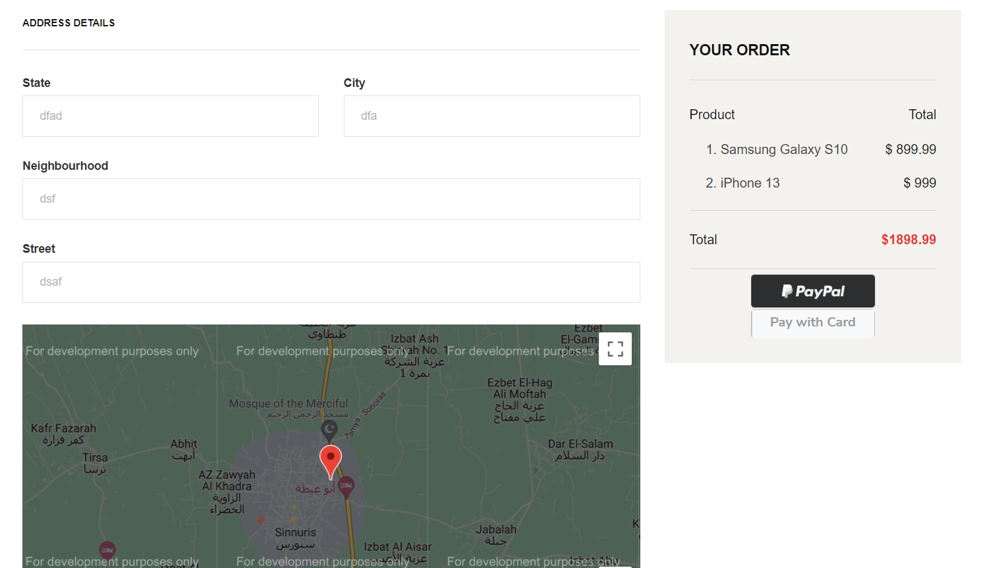
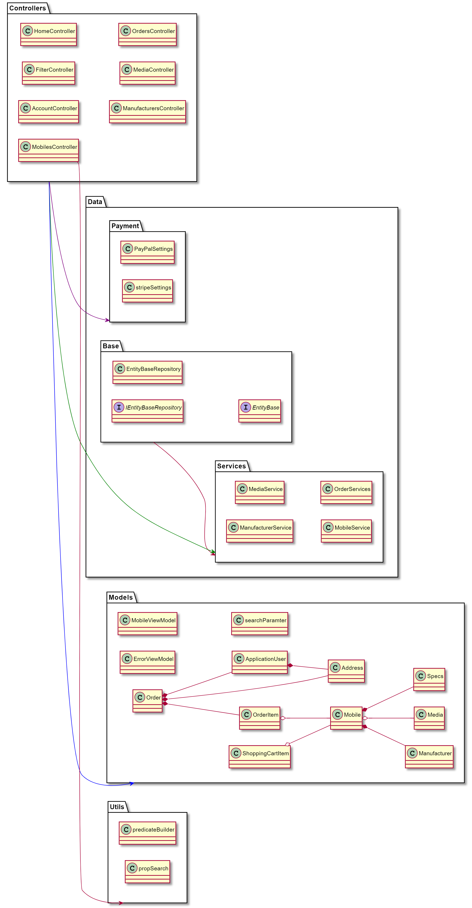

A web based solution for an e-commerce website specialized in selling mobile phones using .Net core .

> Project is part of an ITI 9-month program course MVC
# team members
- Islam Mahrous
- Ahmed Saleh
- Mohamed Fathy
- Hossam Saied
- Abdelrahman Ragab

# Main features:
# Client 
## Account Management
    - registration
    - login / logout
    - support for third party regestration/login using (Facebook)

## Prodauct Navigation
    - Landing Page 
    - Browsing Products in Grid View
    - View Mobile Details
    - Filtering Mobiles by Price, Manfacutre , Specs, etc.

### Landing Page

### Browsing Products

### View Mobile Details

### Filtering Mobiles

## Order 
    - Managing in session cart
    - Support third party payment using Stripe , paypal 
    - Selecting delivery address using google maps
    - View order history
    - Cancel orders

### Cart

### Payment

### Orders

# Admin
## Account Managment
    - Admin login
    - Admin logout
## Orders
    - view all orders created by diffrent users
    - cancel an order for any user

## Products
    - add/edit/delete products

# Development Guide

## Use Case 

## Packages Overview

## Models Class Diagram

