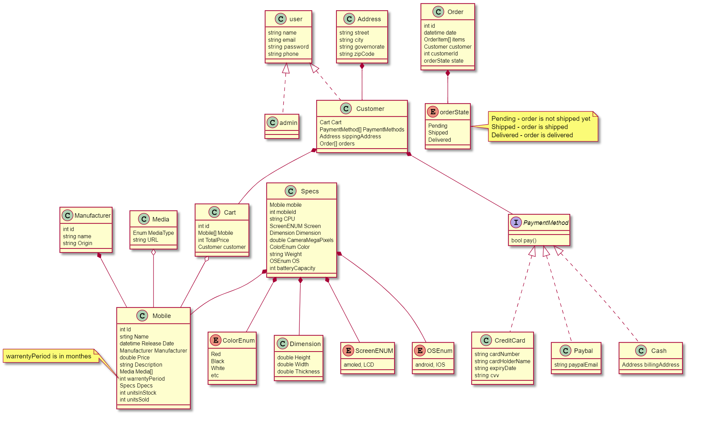

web based solution for e-commerce website specialized in selling mobile phones using .Net core .

> project is part of an ITI 9-month program course MVC
# team members
- islam mahrouse
- Ahmed Saleh
- Mohamed Fathey
- Hossam Saied
- Abdelrahman Ragab

# Site main features:
# client 
## account managment
    - registration
    - login / logout
    - support for third party regestration/login using (Facebook)

## prodauct navigation
    - landing page 
    - browsing products in grid view
    - view mobile details
    - filtering mobiles by price, manfacutre , specs, etc.

### landing page

### browsing products

### view mobile details

### filtering mobiles

## order 
    - managing in session cart
    - support third party payment using Stripe , paypal 
    - selecting delivery address using google maps
    - view order history
    - cancel orders

### cart

### payment

### orders

# admin
## accoutnt managment
    - admin login
    - admin logout
## orders
    - view all orders created by diffrent users
    - cancel an order for any user

## products
    - add/edit/delete products

# Development Guide

## use case 

## packages overview

## models class diagram

